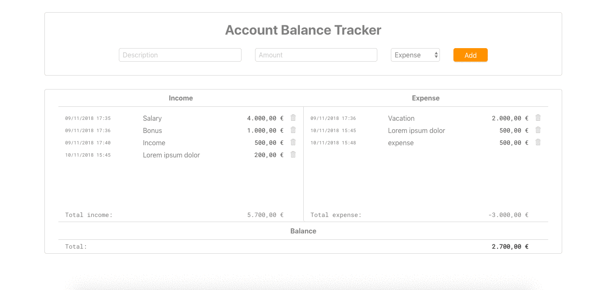

# Account Balance Tracker

### This is a simple account balance tracker created using React. 

See [demo](https://distracted-joliot-d9690a.netlify.com/)

* Takes description and amount for your income or expense.

* Saves the time and date of your entry.

* Calculates total for your income and expense and total balance.

* If you go into debt your balance turns red.

* You can delete each of the entries.

* Saves your data to the local storage.

